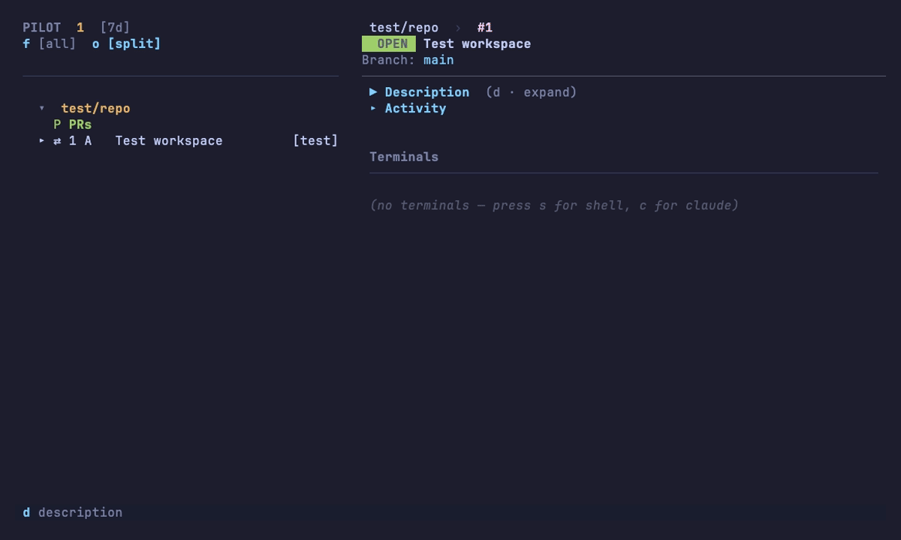

# pilot

**A reactive PR inbox in your terminal.** Instead of refreshing GitHub, events
flow to you — new comments, CI failures, and review requests surface as they
land. Each task opens a git worktree with an embedded terminal for Claude Code,
Codex, Cursor, or a shell. It's for developers juggling many PRs and AI coding
agents at once; think a TUI inbox (lazygit-style) where every row is also a
ready-to-run workspace.



<sub>Prefer not to autoplay? Here's a [static screenshot](demo/pilot.png) and a [seekable MP4](demo/pilot.mp4). The demo is generated from [`demo/pilot.tape`](demo/pilot.tape) — it's code, not a recording.</sub>

## Install

No prebuilt release yet (pre-1.0 — see [Status](#status)), so build from source:

```sh
git clone https://github.com/AntoineToussaint/pilot.git
cd pilot
make setup     # one-shot: downloads pinned zig 0.15.2 to ~/.cache/pilot/zig/
make run       # build + run
```

**Prerequisites:** Rust 1.85+, a C compiler (for bundled SQLite), the
[GitHub CLI](https://cli.github.com/) logged in (`gh auth login` — pilot reads
`gh auth token`), and network access to github.com on the first build. Linux
also needs libc++ + libc++abi (`sudo apt install build-essential pkg-config
libc++-dev libc++abi-dev` on Debian/Ubuntu). Full build notes, troubleshooting,
and the Homebrew/curl channels that land at 1.0 are in the
[Quickstart](https://antoinetoussaint.github.io/pilot/tutorials/quickstart/).

## First 60 seconds

Want to see the UI immediately, with no GitHub account and nothing to configure?

```sh
pilot --test     # throwaway tempdir repo + one seeded workspace, no GitHub
```

You land on the inbox. Then:

```
j / k     move between workspaces
Enter     open the selected workspace
c         spawn a Claude Code session in its worktree   (s for a plain shell)
]]        back to the inbox
```

That's the whole model in one screen: the workspace got an **isolated git
worktree** and a **live embedded terminal**, and you never left the inbox.
Run `pilot` (no `--test`) to do the same against your real PRs — the first
launch walks you through a short setup wizard. Run `pilot --help` any time for
an orientation of every command.

## Documentation

📖 **[antoinetoussaint.github.io/pilot](https://antoinetoussaint.github.io/pilot/)** — organized by what you're trying to do:

- **[Quickstart](https://antoinetoussaint.github.io/pilot/tutorials/quickstart/)** — install → run → your first win, in ~5 minutes.
- **[How-to guides](https://antoinetoussaint.github.io/pilot/how-to/)** — add a repo, run an agent per workspace, per-repo env/mounts, remote over SSH, mirror to Slack.
- **[Reference](https://antoinetoussaint.github.io/pilot/reference/)** — every [CLI command](https://antoinetoussaint.github.io/pilot/reference/cli/), the full [keybindings](https://antoinetoussaint.github.io/pilot/reference/keybindings/), and the [`~/.pilot/config.yaml`](https://antoinetoussaint.github.io/pilot/reference/configuration/) schema.
- **[Explanation](https://antoinetoussaint.github.io/pilot/explanation/)** — the [mental model](https://antoinetoussaint.github.io/pilot/explanation/mental-model/) (worktree- and agent-per-workspace) and the [architecture](https://antoinetoussaint.github.io/pilot/explanation/architecture/).

Copy-paste config starters live in [`examples/`](examples/). Deep architecture
notes are in [`CLAUDE.md`](CLAUDE.md) and [`DESIGN.md`](DESIGN.md); the
per-feature dev catalog — what each piece does, where it lives, and how to test
it — is in [`docs/features/`](docs/features/).

## Essential keys

The bottom hint bar always shows what's available in the focused pane; press `?`
for the full overlay. The ones you'll reach for first:

| Key | Action |
|---|---|
| `Tab` | Cycle Sidebar → Activity → Terminals |
| `j` / `k` · `Enter` | Navigate the inbox · open a workspace |
| `c` / `x` / `u` · `s` | Spawn Claude / Codex / Cursor · spawn a shell |
| `w` | "Work" — spawn Claude with the right prompt for the row's state (fix CI / address comments / implement issue) |
| `m` · `r` | Mark read · reply |
| `Shift-M` · `Shift-V` · `Shift-L` · `Shift-O` | Merge PR · reviewers · labels · open in browser |
| `,` · `?` · `q q` | Settings · help · quit |
| `]]` | Leave a terminal, back to the sidebar |

The [full keybinding reference](https://antoinetoussaint.github.io/pilot/reference/keybindings/) covers every pane.

## Status

Pre-1.0, **early-adopter dev mode**. Daily-driver for the author on macOS; Linux
runs the same code paths but gets less testing. Expect sharp edges, log spam in
`/tmp/pilot.log`, and the occasional breaking change. Prebuilt release channels
(Homebrew tap, `curl | sh`, GitHub Releases) are scaffolded but not yet active —
no version tag has been pushed.

Run a side-by-side dev instance against its own state with `make dev`
(`PILOT_HOME=~/.pilot-dev`) if you want to try pilot without disturbing your
main inbox.

## Contributing & support

Issues and PRs welcome — see [`CONTRIBUTING.md`](CONTRIBUTING.md) for the build
loop and standing rules (tests with every change; the four core libraries stay
dependency-free of each other). Questions, bugs, and feature ideas:
[`SUPPORT.md`](SUPPORT.md) points you at
[Discussions](https://github.com/AntoineToussaint/pilot/discussions) and the
[issue templates](https://github.com/AntoineToussaint/pilot/issues/new/choose).

## License

MIT — see [`LICENSE`](LICENSE).
