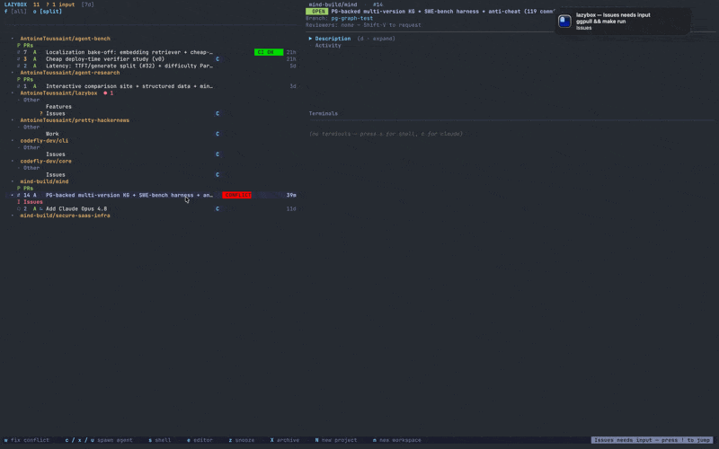

<div align="center">

# 📥 lazybox

**Run a fleet of coding agents from your terminal — and step in when it
matters.** Every task gets its own isolated git worktree and a live embedded
terminal for Claude Code, Codex, Cursor, or a shell, so you can spin up and
juggle many agents without ever managing worktrees by hand. Useful even with a
quiet GitHub.

Wire up GitHub or Linear and it's also a **reactive inbox**: instead of
refreshing, events flow to you — new comments, CI failures, and review requests
surface as they land, with per-row read/unread tracking.

Think a TUI inbox (lazygit-style) where every row is also a ready-to-run
workspace — built for developers juggling many PRs and AI coding agents at once.

[](https://github.com/AntoineToussaint/lazybox/releases/latest)
[](https://github.com/AntoineToussaint/lazybox/actions/workflows/ci.yml)
[](https://github.com/AntoineToussaint/homebrew-lazybox)
[](https://www.rust-lang.org)
[](#install)
[](LICENSE)
[](https://lazybox.ai/docs/)

</div>

<div align="center">

<video src="https://github.com/user-attachments/assets/c3f11255-5cba-4904-8c58-299ebfcccef6" poster="demo/hero.png" controls muted autoplay loop playsinline width="900">
  
</video>

</div>

<sub>Video not playing? Here's the [animated GIF](demo/hero.gif) and a [static screenshot](demo/hero.png). There's also a fully reproducible `--test` demo — code, not a recording — driven by [`demo/lazybox.tape`](demo/lazybox.tape).</sub>

## ✨ Highlights

- **📨 Reactive inbox** — new comments, CI failures, and review requests surface automatically, with per-row read/unread tracking. No refreshing.
- **🌳 A worktree per task** — every row opens an isolated git worktree, so PRs never step on each other's working trees.
- **🤖 Point at the work and press `w w`** — lazybox turns the focused issue, CI failure, conflict, or selected review comments into the right brief, then reuses the running agent or starts your default in the task worktree.
- **🎚️ GitHub-controlled compute** — a `best` / `high` / `medium` / `low` label or `@best` / `@high` / `@medium` / `@low` task-body marker maps through the target agent's model tiers, so GitHub can choose model and reasoning effort before work starts. `best` is the strongest configured tier — pin model *and* max effort together.
- **⚡ Repeatable workflows with memory** — `]]srev` sends a complete review workflow in one action; Recent remembers what you reuse, and each workspace's `]N` badge tracks up to 12 recently distinct snippet workflows.
- **🖥️ Embedded terminals** — a live PTY per workspace (split & tile them), powered by a vendored ghostty VT parser.
- **🔌 Source-agnostic** — GitHub and Linear today, surfacing in one inbox behind the same interface, with an optional Slack mirror.
- **🛰️ Remote-friendly** — a client/daemon split runs over an SSH-forwarded socket for working against a remote box.

## Performance and reliability

**Responsiveness under load:**

- **Async bus-lag recovery** — when clients lag behind the event bus, recovery snapshots are built asynchronously off the serve loop, so the UI never freezes (previously up to 4-second stalls).
- **Polling backoff** — the scheduler exponentially backs off on empty polls (5s → 10s → ... → 150s max) to reduce idle CPU, resetting to base interval when data arrives. Instant on user refresh.
- **Lock scope reduction** — provider registry operations are single-acquisition (acquire, copy, release) so slow I/O doesn't serialize unrelated operations. Keystroke dispatch is off the global queue entirely.
- **Per-terminal event gating** — resync requests are per-terminal, so one congested connection doesn't cascade backpressure to all others.

**Terminal integrity:**

- **Ring buffer validation** — capacity is validated at init (must be nonzero and ≤100 MiB) to catch misconfiguration before it silently loses data.
- **Per-terminal byte ceiling** — output buffers cap at 64 MiB; crashed agents drop their VT and render a freeze-frame rather than exhausting memory.
- **DEC-mode sync** — terminal modes (bold, color, charset) stay synchronized between server and client; replays are never torn, and resize events are sequenced with output to prevent mid-redraw corruption.
- **Archive reconciliation** — archived status is checked per-item during each poll, so reopened PRs and unarchived issues resurface correctly.

For deep dives on these improvements, see [`docs/ARCHITECTURE.md`](docs/ARCHITECTURE.md) and [`docs/TROUBLESHOOTING.md`](docs/TROUBLESHOOTING.md).

## Install

Prebuilt binaries (macOS arm64/x86_64 and Linux x86_64):

**Homebrew** (the supported install path):

```sh
brew tap AntoineToussaint/lazybox && brew trust AntoineToussaint/lazybox && brew install lazybox
```

Then `gh auth login` (if you haven't) and run `lazybox`.

**Desktop app (macOS):** a Tauri desktop client is in the works but **not yet
released** — there is no `lazybox-desktop` Homebrew cask or `.dmg` to install
today. Run the TUI above; the signed cask and `.dmg` download will land here with
the first desktop release.

Lazybox checks for newer builds at startup and shows an update notice when one
is available. It never updates itself: the notice identifies Homebrew versus
shell-installer releases and scopes source rebuild commands to the checkout
that produced the running binary.

Prefer to build it yourself, or hacking on lazybox? Build from source:

```sh
git clone https://github.com/AntoineToussaint/lazybox.git
cd lazybox
make setup     # one online preparation of pinned Zig, Ghostty, and Cargo caches
make run       # build + run
make release   # optimized build; strictly offline after setup
```

**Prerequisites:** Rust 1.88+, a C compiler (for bundled SQLite), the
[GitHub CLI](https://cli.github.com/) logged in (`gh auth login` — lazybox reads
`gh auth token`) for real GitHub-backed runs. `lazybox --test` does not require
`gh`. Network access is used by `make setup` once; the pinned Zig archive is
checksum-verified and Ghostty/Cargo sources are cached under
`~/.cache/lazybox/`. After setup, `make release` enables Cargo offline mode and
does not fetch dependencies.

Linux also needs a C/C++ toolchain plus **libc++ and libc++abi** — the embedded
ghostty terminal is built by zig against LLVM's libc++ (not GNU libstdc++), so
the link step fails without them. `make setup` checks for these and points you
at the right command for your distro:

```sh
# Debian/Ubuntu
sudo apt install build-essential pkg-config libc++-dev libc++abi-dev
# Fedora/RHEL
sudo dnf install gcc gcc-c++ pkgconf-pkg-config libcxx-devel libcxxabi-devel
# Arch
sudo pacman -S --needed base-devel pkgconf libc++ libc++abi
```

Install details (Homebrew and contributor source builds), build notes, and
troubleshooting are in the [Quickstart](https://lazybox.ai/docs/tutorials/quickstart/).
Release history is in [`CHANGELOG.md`](CHANGELOG.md), and private vulnerability
reports follow [`SECURITY.md`](SECURITY.md).

## First 60 seconds

Want to see the UI immediately, with no GitHub account and nothing to configure?

```sh
lazybox --test     # throwaway tempdir repo + one seeded workspace, no GitHub
```

You land on the inbox. Then:

```
↑ / ↓     move between workspaces   (j / k also works)
Enter     open the selected workspace
w w       route this task to its running/default agent     (s for a plain shell)
          wait for that contextual task to finish
]]srev    review the result with the built-in workflow     (agent terminal)
]]q       leave the terminal, back to the inbox
```

`w` opens the work menu; `w w` builds the right prompt for the row's state,
sends it to the relevant running agent when there is one, or starts your
default agent in the task worktree. It needs that agent's CLI (e.g. `claude`)
on your `PATH`; `s` (a plain shell) always works. To pick an agent explicitly,
`a` opens the agent menu (`a c` Claude · `a x` Codex · `a u` Cursor).

After the contextual task finishes, keep its agent terminal focused. `]]s`
opens the categorized snippet picker with a live body preview. A unique key
like `rev` submits immediately; open `]]s` later and the last workflow is
selected in **Recent**, ready to repeat with `Enter`. The workspace's `]1`
sidebar badge records that one recently distinct workflow has already been sent.

That's the whole model in one screen: the workspace got an **isolated git
worktree**, a **live embedded terminal**, and a repeatable workflow with memory,
and you never left the inbox.
Run `lazybox` (no `--test`) to do the same against your real PRs — the first
launch walks you through a short setup wizard. Run `lazybox --help` any time for
an orientation of every command.

## Documentation

📖 **[lazybox.ai/docs](https://lazybox.ai/docs/)** — organized by what you're trying to do:

- **[Quickstart](https://lazybox.ai/docs/tutorials/quickstart/)** — install → run → your first win, in ~5 minutes.
- **[Core workflows](https://lazybox.ai/docs/tutorials/core-workflows/)** — transparent worktrees, attention-driven agent orchestration, snippets with memory, issue→PR continuity, restart-safe sessions, and the complete GitHub loop.
- **[How-to guides](https://lazybox.ai/docs/how-to/)** — add a repo, run an agent per workspace, per-repo env/mounts, remote over SSH, mirror to Slack.
- **[Reference](https://lazybox.ai/docs/reference/)** — every [CLI command](https://lazybox.ai/docs/reference/cli/), the full [keybindings](https://lazybox.ai/docs/reference/keybindings/), and the [`~/.lazybox/config.yaml`](https://lazybox.ai/docs/reference/configuration/) schema.
- **[Explanation](https://lazybox.ai/docs/explanation/)** — the [mental model](https://lazybox.ai/docs/explanation/mental-model/) (worktree- and agent-per-workspace) and the [architecture](https://lazybox.ai/docs/explanation/architecture/).

Copy-paste config starters live in [`examples/`](examples/). Deep architecture
notes are in [`CLAUDE.md`](CLAUDE.md) and [`DESIGN.md`](DESIGN.md); the
per-feature dev catalog — what each piece does, where it lives, and how to test
it — is in [`docs/features/`](docs/features/).

## Essential keys

The bottom hint bar always shows what's available in the focused pane. Press `?`
for Ask Lazybox—type to search the live keymap or ask a workflow question, then
press `?` again for the compact index. lazybox is also fully mouse-driven—click a pane or row
to focus it, drag the splitters to resize, wheel-scroll, and right-click links
(or rows) for the context menu. The keys you'll reach for first:

| Key | Action |
|---|---|
| `Tab` | Cycle Sidebar → Activity → Terminals |
| `↑` / `↓` · `Enter` | Navigate the inbox (`j` / `k` also works) · open a workspace |
| `a` · `s` | Agent menu (which-key popup): `a c` Claude · `a x` Codex · `a u` Cursor · `s` spawns a shell (`a c` needs the `claude` CLI on `PATH`; `s` always works) |
| `w` | Work menu (which-key popup): `w w` uses the default/running agent · `w c` Claude · `w x` Codex · `w u` Cursor · `w S/M/L` chooses a model tier |
| `x` | Workspace menu: `x n` new workspace · `x p` new project · `x a` adopt sessions · `x j` join into PR · `x z` long snooze · `x x` archive · `x c` close issue |
| `m` · `r` | Mark read · reply |
| `g` | GitHub menu (which-key popup): `g m` merge · `g g` auto-merge on green · `g r` reviewers · `g a` assignees · `g l` labels · `g o` open in browser |
| `,` · `?` · `q q` | Settings · Ask Lazybox · quit |
| `]]` | Terminal leader (which-key popup): `]]q` back to the sidebar · `]]s` snippets · `]]f` focus mode · `]]\|` / `]]-` split · `]]x` close |

Power moves, once the basics feel natural:

- **Model tiers** — a GitHub `best` / `high` / `medium` / `low` label (or `@best` / `@high` / `@medium` / `@low` task-body marker) automatically chooses the target agent's configured model and reasoning-effort arguments at spawn; `best` picks the strongest configured tier (model *and* max effort) and wins over a co-declared `high`. `w S` / `w M` / `w L` is the direct in-TUI override; Claude ships a Haiku/Sonnet/Opus menu and other agents configure theirs under `agents.<id>.models`. Map a priority to a tier under `agents.<id>.models.priority` (e.g. `best: B`); an alias no tier defines warns at config load rather than silently spawning the agent's own default. The picked tier rides a `◆ Opus` tab badge.
- **Multi-agent orchestration** — `v` selects workspaces across repos, then `Shift-B` lets you review one snippet-seeded or free-text instruction and safely fan it out; follow the [broadcast guide](https://lazybox.ai/docs/how-to/orchestrate-multiple-agents/).
- **Focus mode** — `.` (or `]]f` from a terminal) near-fullscreens the agent terminal; `]]<digit>` jumps straight to the Nth agent workspace.
- **On main** — `b` leader (`b c` / `b s`, confirmed first) runs an agent or shell on the repo's shared main checkout instead of a worktree; the tab carries a `⎇ main` badge.
- **Jump anywhere** — `` ` `` opens a fuzzy workspace picker across all repos (from a terminal: `]]` then `` ` ``); `!` jumps to an agent waiting on input, `Shift-F` to failing CI.
- **Themes & messages** — `t` opens a live-preview theme picker; `Shift-M` shows the log of recent footer notices.
- **Snippet workflows** — `]]s<key>` sends a built-in, global, or launch-directory workflow; Recent persists what you reuse, `]N` tracks up to 12 recently distinct workflows per workspace, and `Shift-B` broadcasts one across selected agents. See [`docs/snippets.md`](docs/snippets.md).

The [full keybinding reference](https://lazybox.ai/docs/reference/keybindings/) covers every pane.

## Status

Pre-1.0, **early-adopter dev mode**. Daily-driver for the author on macOS; Linux
runs the same code paths but gets less testing. Expect sharp edges, log spam in
`/tmp/lazybox.log`, and the occasional breaking change. Prebuilt binaries ship
via the Homebrew tap (see [Install](#install)).

Run a side-by-side dev instance against its own state with `make dev`
(`LAZYBOX_HOME=~/.lazybox-dev`) if you want to try lazybox without disturbing your
main inbox.

## Support lazybox

Lazybox is MIT-licensed and developed in public. If it saves you time, you can
[sponsor its development on GitHub](https://github.com/sponsors/AntoineToussaint).
Sponsorships fund maintenance, releases, and the infrastructure behind the
project; the open-source TUI and daemon remain available to everyone.

## Contributing & support

Issues and PRs welcome — see [`CONTRIBUTING.md`](CONTRIBUTING.md) for the build
loop and standing rules (tests with every change; the core library crates keep
their strict dependency layering). Participation is under our
[`CODE_OF_CONDUCT.md`](CODE_OF_CONDUCT.md). Questions, bugs, and feature ideas:
[`SUPPORT.md`](SUPPORT.md) points you at
the [question, bug, and feature templates](https://github.com/AntoineToussaint/lazybox/issues/new/choose).

**Get in touch** — open a thread in
[GitHub Discussions](https://github.com/AntoineToussaint/lazybox/discussions)
for open-ended questions and ideas, or email
[toussaint.antoine@gmail.com](mailto:toussaint.antoine@gmail.com) to reach the
author directly.

## License

MIT — see [`LICENSE`](LICENSE).
