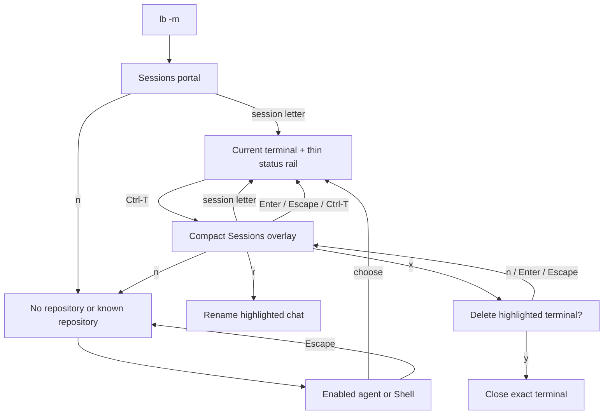

# Mobile terminal audit

The desktop TUI assumes several panes, long legends, and easy access to modified
keys. On a phone, the software keyboard changes the available terminal size and
letters are much easier to reach than desktop leader sequences. This audit drove
the per-client mobile presentation selected by `lb -m` / `lazybox --mobile`.
See [mobile.md](mobile.md) for the implemented controls and status legend.

## Input and layout constraints

- Use terminal cell dimensions, not device pixels or a fixed phone model.
- Keep a working path using ordinary letters, Return, Escape, and a small set of
  Ctrl shortcuts. Termius's customizable keyboard can expose these shortcuts;
  its toolbar order and available rows are user preferences, not app constants.
- Preserve literal typing and bracketed paste in terminals and text inputs.
  Session shortcuts belong only to the Sessions portal/overlay.
- Reserve action/navigation keys before assigning session letters. Both views
  must draw and resolve the same selector mapping.
- Preserve the current terminal while browsing, renaming, or deleting another
  session. Confirm deletion against a captured identity, never a moving index.
- Keep action hints visible while long descriptions or input values scroll.
- Opening Sessions must not resize the running PTY. The thin status rail costs
  one column; its expanded panel overlays the existing terminal geometry.

[Termius mobile terminal documentation](https://docs.termius.com/terminal/mobile-terminal)
was the reference for the original input audit. Physical iOS keyboard, font,
touch, and mouse-report behavior still need device testing. The automated and
live Linux tests use phone-sized terminal grids rather than claiming iPhone coverage.

## Presentation boundary

`realm/presentation.rs` defines the client-local presentation profile, modal
geometry, wrapping, header, and scrolling reader helpers. The profile travels
through normal, test, practice, socket, and relay launch paths without modifying
shared UI settings. `mount_modal_boxed` passes it to shared components through
one attribute; desktop components keep their existing behavior.

`realm/model/mobile.rs` adapts mobile input to existing model/domain operations.
`mobile_sessions.rs` projects actual terminals into named status rows, and
`mobile_rail.rs` owns selectors, highlighting, paging, and rendering for both the
startup portal and compact Sessions overlay. It owns no PTYs, credentials,
provider data, or durable workspace state. Creation, rename, and close continue
through existing daemon commands and terminal lifecycle APIs.

The active terminal uses the existing focus renderer, including its scrollback
and mouse mapping. The desktop split layout remains available. Pane geometry
only requests daemon resizes; VT dimensions continue to come from daemon stamps.
Two clients attached to one PTY still share its dimensions.

Normal mobile launch attaches to an existing daemon or starts a detached one,
so closing/reopening the client preserves processes. Test mode remains disposable.
Startup does not require provider onboarding or a repository; creation first
chooses an area and then an enabled agent or a shell.

## Implemented screen map

The portal and overlay share their action bindings. Canceling a sheet restores
its parent and selection. Deleting a terminal preserves sibling terminals and
workspace files. The status palette and desktop glyph differences are documented
in [mobile.md](mobile.md); selection uses a neutral theme background.

## Full screen-family audit

| Screen family | Narrow-screen issue | Current treatment / remaining work |
| --- | --- | --- |
| Sessions / desktop Sidebar | Scope headers and multiple panes consume width | Dedicated terminal projection; shared portal/overlay with live status rail, paging and explicit selectors |
| Terminal tabs / split tiles | Tab strip and splits crowd the terminal | Existing single-terminal renderer; desktop layout is preserved; keyboard and wheel scrollback |
| Splash / setup wizard | Large prose and controls below the fold | Mobile welcome and shared full-width sheets; normal mobile startup opens Sessions directly |
| Choice: providers, agents, scopes, repositories, filters | Long descriptions, wide footer, many toggles | Shared phone layout, pinned controls, scrolling details, group/All items bulk selection |
| Input: rename, names, tokens, paths, URLs | Wrapping can hide the insertion point and submit hint | Shared mobile input presentation, visible insertion end and pinned controls |
| Loading / Error / informational sheets | Long text can cover dismissal keys | Shared wrapping reader and pinned dismissal/scroll controls |
| Delete confirmation | A stray Enter must not kill a process | Mobile explicit `y` confirmation, captured terminal ID, Enter/Escape cancel |
| Other Confirm flows | Desktop-sized prompts can still be dense | Existing shared behavior; not all advanced flows are optimized |
| Settings | Horizontal tabs and long lists truncate | Mobile section label, h/l sections, scrolling selected row and pinned help |
| HelpAsk | Search, input and answer compete for rows | Full-width mobile layout, mobile bindings and independent answer scrolling |
| Activity / repository overview | Rich cards assume a neighboring pane | Not in the minimal Sessions surface; future component presentation work |
| JumpPicker / PromptHistoryPicker | Filter input competes with table/preview | Existing renderer; future list/detail switching without remapping text |
| Textarea: reply, notes, broadcast, handoff | Multiline entry and modifier-based submission | Existing renderer; future explicit compose/review/send workflow |
| Hopper | Ordered editor, project selection and reordering | Existing renderer; future single-column row editing |
| Snippet / Skill pickers and browsers | Preview, filtering and alternate submit actions | Existing renderer; future browse/preview/run steps |
| Description / MarkdownModal | Long prose and width-sensitive code | Existing reader; future mobile viewport policy |
| DiffReview | Files, hunks, code and replies need width | Existing renderer; future file/hunk/action workflow |
| PrChat | Context, transcript and composer compete | Existing renderer; future history/compose switch |
| IssueBrowser | List, filters, preview and mutations | Existing renderer; future list/detail workflow |
| MergeHistory / MergeOrder | Chronology and dependencies span columns | Existing renderer; future ordered rows with details |
| EpicGraph | Graph branches consume horizontal space | Existing renderer; future dependency list |
| Polling / SyncStatus / WorktreeProgress | Status rows can take input focus | Mobile creation progress stays in the footer; failures use a readable error sheet |
| Messages / ErrorInbox / Stats | Dense tables and long logs | Existing renderer; future summary/details sheets |
| Footer / which-key / context menus | Long legends and punctuation leaders | Mobile Sessions has its own pinned action row; hidden desktop pane actions do not receive mobile navigation |
| Practice / coach | Additional chrome consumes keyboard-open viewport | Practice banner preserved; desktop coach rail hidden on mobile |

The remaining desktop screens are not duplicated or claimed as phone-optimized.
Shared component presentation can be extended incrementally without replacing
workspace state or the desktop action catalog.

## Validation boundaries

Tests cover narrow/tiny geometry, shared picker bulk actions, input ownership,
selection stability, exact-terminal management, daemon creation hand-offs, and
desktop isolation. Isolated real-terminal smoke tests exercise shell/agent
launching, switch/cancel/delete flows and client reconnect at 39×18 and 32×12.
Agent processes in those tests are local fixtures, not authenticated provider runs.
Physical Termius interaction and simultaneous physical laptop/phone use remain
unverified; persistent processes do not survive a device reboot.
